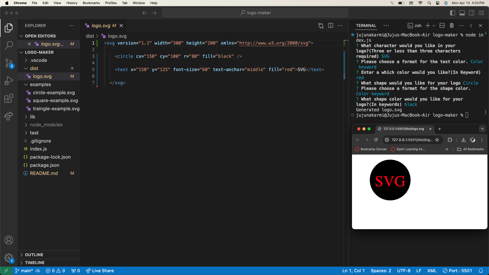

  # SVG Logo Maker
 
  
 
  
  ## Description
  Generate an **SVG logo** with your choice of shape (*circle, square, or triangle*), shape color, text (limit of 3 characters), and text color. Shape and text colors can be chosen using color keywords or hexadecimal numbers.

  Watch a [video]() demonstration of the basic functionality:

  ## Table of Contents

* [Installation](#installation)
* [Usage](#usage)
* [Screenshots](#screenshots)
* [License](#license)
* [Contributing](#contributing)
* [Tests](#tests)
* [Contact](#contact)

## Installation

First thing you need to do is to check if you have Node.js installed by typing "node -v" in your command line. If node is not installed, visit the [Node.js](https://nodejs.org/en) to install. Next, clone this project repository to your computer locally. Use the command "npm install" to install dependecies. Use the command "npm install" or "npm i" to install inquirer and jest.

## Usage

Open your new project in VS code and open the local repo and open terminal. You can start the application by typing "node index.js"  in the terminal's command line. You will be prompted with series of questions before your logo is generated. If you do not enter a valid color keyword or hexadecimal number, you will be prompted to try again. If your text contains more than 3 characters, you will be prompted to try again. Once all prompts have been answered with correct values, your new logo will be generated with the file name 'logo.svg' in the 'dist' folder. You can also check my video in the description.

### Screenshots

## License

[MIT License](https://opensource.org/licenses/MIT)

## Contributing

There are no guidelines for contributing at this time. Contact me with any ideas or requests if anybody want to contribute.

## Tests
Each shape class (Circle, Square, and Triangle) is tested for a render() method that returns a string for the corresponfing SVG file matching color and text requests. Type "npm test" in the command line and Jest will run all three tests.

## Contact
* Email: jujunakarmi@gmail.com
* LinkedIn:[https://www.linkedin.com/in/juju-nakarmi-1a79a7181/](https://www.linkedin.com/in/juju-nakarmi-1a79a7181/)
